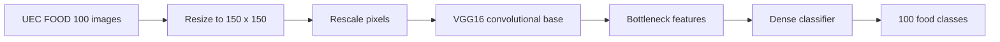

# Food Recognition with VGG16 Transfer Learning

A historical computer-vision project for classifying food images across 100 categories using transfer learning with VGG16.

The project was built in 2016 as part of Data Science Retreat work. It predates modern TensorFlow/Keras APIs and uses the Theano backend, but the repository preserves the original training and evaluation notebooks and their recorded experimental results.

## Results

Evaluation was performed on 4,428 validation images across 100 classes.

| Metric | Accuracy |
| --- | ---: |
| Top-1 | **69.49%** |
| Top-5 | **91.24%** |
| Top-10 | **95.66%** |

The top-k results are computed by ranking the model's predicted class probabilities and checking whether the true class appears among the highest-ranked predictions.

## Approach

The experiment uses the UEC FOOD 100 dataset split into:

- **10,183 training images**
- **4,428 validation images**
- **100 food classes**
- Images resized to **150 x 150**

The model starts from an ImageNet-pretrained VGG16 convolutional network. The original workflow first extracts bottleneck features, trains a new classifier on top, then fine-tunes part of the convolutional network with a low learning rate.

### Training stages

1. Load ImageNet-pretrained VGG16 convolutional weights.
2. Extract bottleneck features for the training and validation sets.
3. Train a small fully connected classifier over the frozen features.
4. Attach the classifier to VGG16.
5. Freeze the earlier layers and fine-tune later layers using SGD with a low learning rate.
6. Evaluate top-1 and ranked top-k predictions on the held-out validation set.

## Repository contents

| File | Purpose |
| --- | --- |
| [`Food100-NEW.ipynb`](Food100-NEW.ipynb) | VGG16 setup, bottleneck-feature extraction, classifier training, and fine-tuning |
| [`model_testing_evaluating.ipynb`](model_testing_evaluating.ipynb) | Model loading, inference, validation evaluation, and top-k analysis |
| `class_indices_map.p` | Serialized mapping between prediction indices and dataset classes |
| `food_info.p` | Serialized food metadata used by the original project |

## Technical stack

- Python
- Keras
- Theano
- VGG16 / ImageNet transfer learning
- NumPy
- Pandas
- HDF5 / h5py
- Matplotlib
- PIL
- GPU training, originally run on an NVIDIA GeForce GTX 960M

## Historical implementation notes

This repository contains the original 2016 notebooks rather than a modernized rewrite. Several APIs used here have since changed or been removed, including the Theano Keras backend and older `fit_generator`, `predict_generator`, and VGG16 weight-loading patterns.

The notebooks also reference local dataset paths and trained model files that are not committed to the repository. As a result, they should be treated as a record of the original experiment rather than as a currently reproducible package.

Keeping the original implementation intact preserves the experimental context and makes the evolution of the deep-learning tooling visible.

## Model details

The classifier head used in the original experiment includes a 256-unit dense layer, dropout, and a 100-unit output layer. During fine-tuning, the first 25 layers of the assembled model were frozen and the remaining layers were optimized with categorical cross-entropy and SGD.

## Project status

**Completed historical project.** The repository is retained as an example of early transfer-learning work for multi-class image classification.
